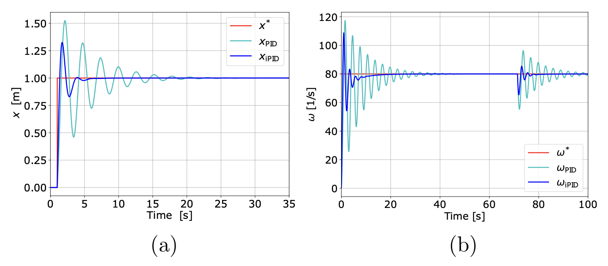
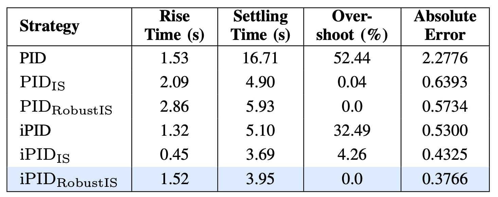
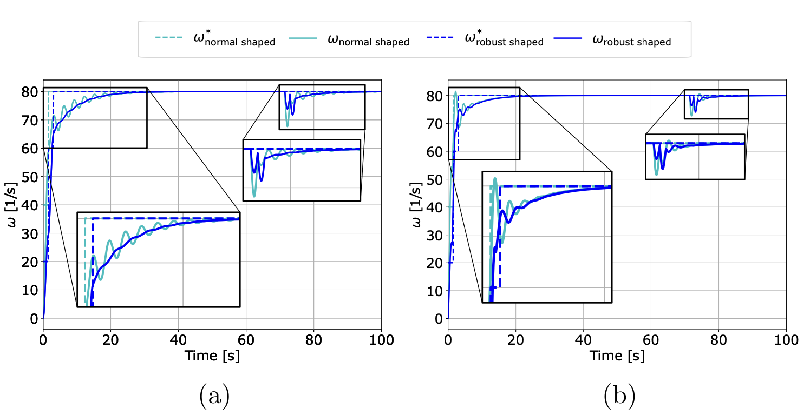
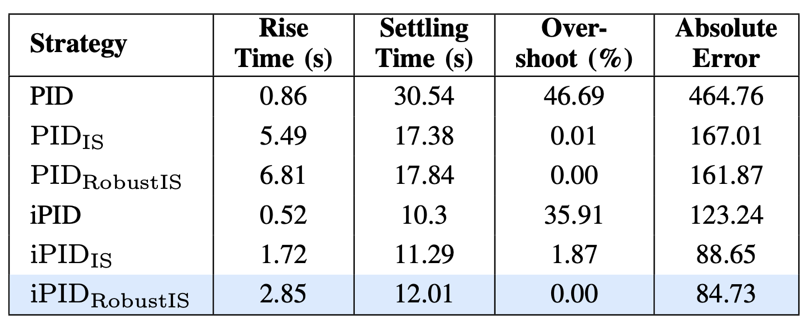
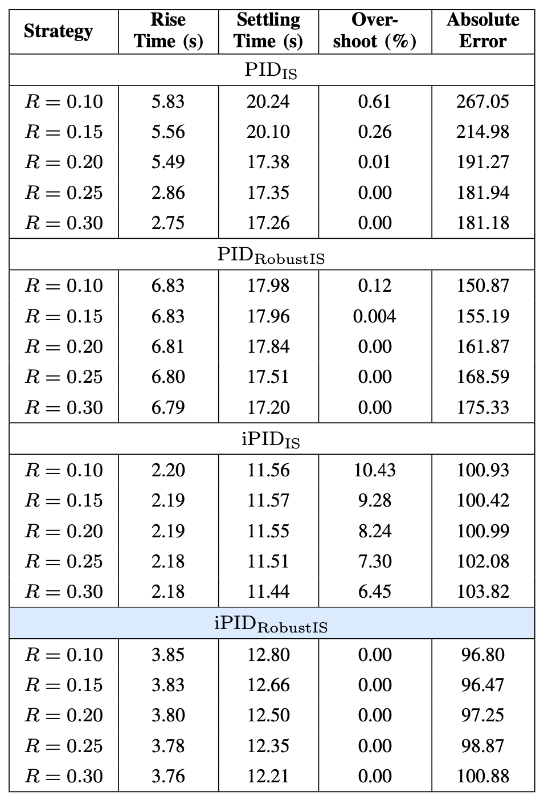

# Intelligent PID Control Augmented with Input Shaping for Precision Motion Control in Dynamic Systems

<p align="center">
  
</p>
<p align="center">
  Fig: Transformation of classical PID control loop into iPID via unknown dynamics elimination with input shaping.
</p>

This repostitory contains the code, data, and methods used to analyze the performance of input shaping and an intelligent PID control mechanism, and compare it to that of a similar classical PID. To do this, the code simulates the behavior of these PID systesm, graphs them, and then tabulates multiple quantitative charateristics of their trajectories to compare directly.

*Note: Certain code segments have been omitted due to ongoing manuscript reviews.*

---

## Project Structure

   - `SpringMassSystem.py` - Characteristics and differential equation of the spring mass system.
   - `DC_Motor.py` - Characteristics and differential equation of the DC motor.
   <!-- - 'PID_controller.py' - Characteristics and PID calculation of PID controller. -->
   <!-- - 'iPID_controller.py' - Characteristics and modified PID calculation of iPID controller. -->
   <!-- - 'Closed_loop.py' - Runs simulation by solving the differential equation incorporating both system and controller in a loop that lasts a specified duration. -->
   <!-- - 'PerformanceMetrics.py' - Calculates the quantitave properties of system trajectories. -->

   - `run_SpringMass.py` – Simulates PID and iPID closed-loop control of a spring–mass system; generates plots and tables.  
   - `run_DC.py` – Simulates PID and iPID closed-loop control of a DC motor system; generates plots and tables.  

---

## Requirements

- matplotlib==3.10.3
- numpy==2.3.0
- pandas==2.3.0
- pyDOE==0.3.8
- pyDOE==0.3.8
- scipy==1.15.3
- seaborn==0.13.2

Install dependencies using:

```bash
pip install -r requirements.txt
```
---

## How to Run

### Step 1: Setup

Download or clone the repository:

```bash
git clone https://github.com/NyiNyi-14/i_PID.git
```

Make sure all scripts are in the same directory.

### Step 2: Specifications

 Before running the code, update the system and controller parameters to simulate your own setup.
- System parameters: (m, k, R, L, Kb, Kt, J, B)  
- Controller tuning: (Kp, Ki, Kd)  
- Initial conditions: (x0, v0, ω, ia)  
- Simulation settings: (duration, dt)  

<!-- In the run_DC.py script, select the reference signal and data to evaluate in the tables, as described in the comment on lines 458-459, and lines 493-494. -->

Set the appropriate output paths to ensure graphs are saved in the desired locations.  

### Step 3: Generate Figures and Tables

Run the main scripts to perform simulations and automatically generate figures.  

```bash
python run_SpringMass.py
```

```bash
python run_DC.py
```

- These scripts simulate dynamic systems under PID and iPID control with various reference inputs: aggressive step, exponential, normal input shaping, and robust input shaping.  

---

## Results



- Responses from systems to aggressive step reference.
    - (a) Spring mass system.
    - (b) DC motor system.


- Responses from spring-mass system to normal and robust input shaped reference.
    - (a) PID controlled.
    - (b) iPID controlled.

 

- Quantitative evaluation of performance of spring mass with input shaped reference.



- Responses from DC motor system to normal and robust input shaped reference.
    - (a) PID controlled.
    - (b) iPID controlled.
 
 

- Quantitative evaluation of performance of DC motor system with input shaped reference.


- Responses from DC motor system with uncertain resistance to input shaped references.
    - (a) PID controller with normal input shaping.
    - (b) PID controller with robust input shaping.
    - (a) iPID controller with normal input shaping.
    - (b) iPID controller with robust input shaping.

 

- Quantitative evaluation of performance of DC motor system with uncertain resistance and input shaped reference.

---

## Related Work

This project builds on developed control mechanisms, including:

- Intelligent PID

- Input Shaping

---

## Citation

If you use this work, please cite the related paper as follows:
<!-- 
---

## Author

**Nyi Nyi Aung** 

PhD Student, Mechanical and Industrial Engineering - LSU, USA

MSc, Sustainable Transportation and Electrical Power Systems - UniOvi, Spain

BE, Electrical Power - YTU, Myanmar

##

**Bradley Wight** 

B.S. Student, Mechanical Engineering

Louisiana State University

##

**Adrian Stein, PhD**

Assistant Professor

Department of Mechanical and Industrial Engineering

Louisiana State University

## -->